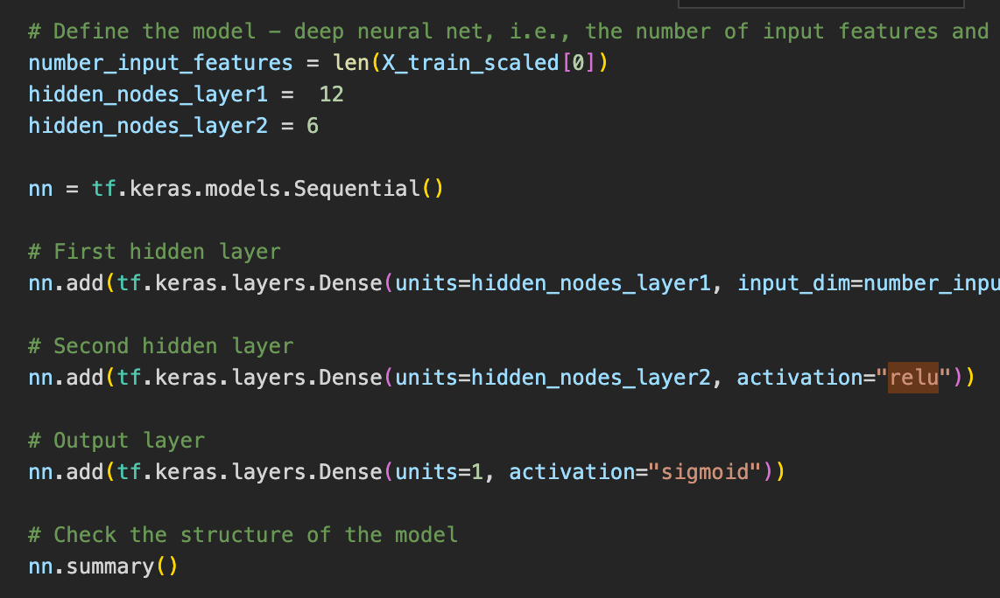
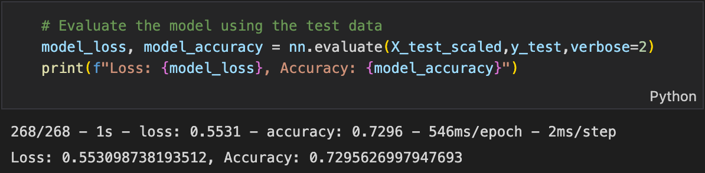
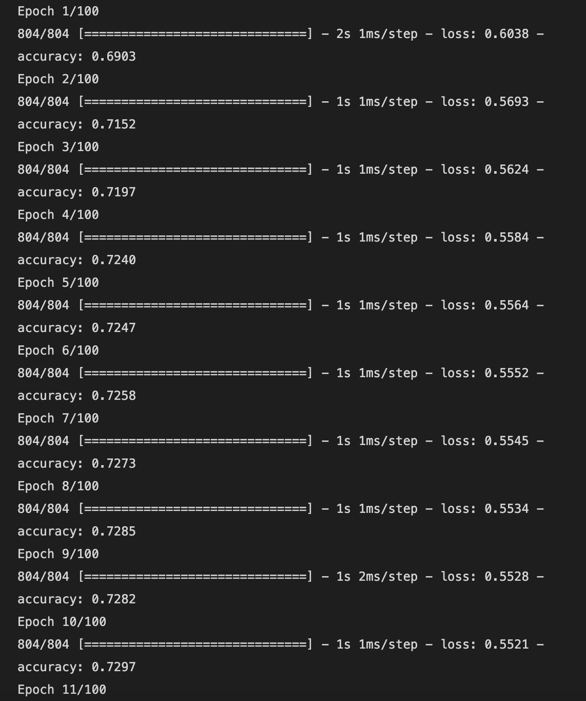

# Neural Network Charity Analysis

## Overview and Purpose

AlphabetSoup is dedicated to enhancing global well-being by supporting environmental conservation and improving people's lives. The objective of this project is to assess the impact of the organization's donations to different charities and identify the ones that are worthy of support, while avoiding high-risk options to prevent wastage of resources. To accomplish this, we will leverage a neural network implemented in Python using the TensorFlow library, aiming to provide concise and informative outcomes.

## Results

### Data Preprocessing

• What variable(s) are considered the target(s) for your model?
The target variable for this model is the IS_SUCCESSFUL label.

• What variable(s) are considered to be the features for your model?
The featured variable for this model is the IS_SUCCESSFUL label.

• What variable(s) are neither targets nor features, and should be removed from the input data?
The NAME and EIN columns were removed from the input data because they are not relevant.

### Compiling, Training, and Evaluating the Model

• How many neurons, layers, and activation functions did you select for your neural network model, and why?
For the optimized model, the number of neurons used was 80 for the first layer and 30 for the 2nd. While the first 2 layers used the reLu activation function, I used the sigmoid function for the output layer as shown in the image below.

• Were you able to achieve the target model performance?
No, the highest that I was able to get was 72.9%

• What steps did you take to try and increase model performance?
I tried to increase the number of neurons and changing the activation functions. Here, the model runs for 100 epochs.

## Summary

The results show that using the ReLu and sigmoid functions yielded the an accuracy of 72.9% using various numbers of neurons and layers. I would recommend using a different model if different results are desired.
